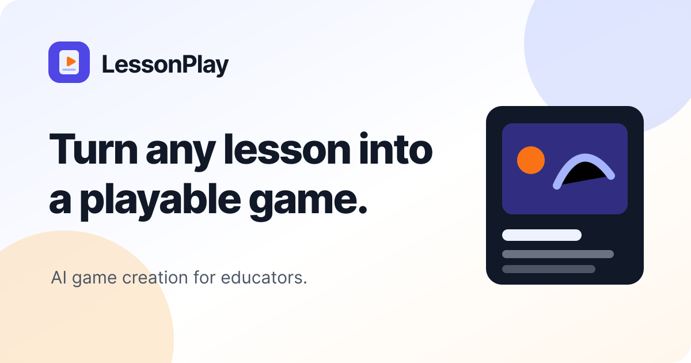

# LessonPlay

**Turn any lesson into a playable game.**

LessonPlay is an AI-assisted educational-game studio for teachers and educational creators. Describe a concept or textbook chapter, choose a focused game idea, and follow the build from conversation to a playable, published experience.

The product application lives in [`my-app/`](my-app/). Its [README](my-app/README.md) covers product capabilities, architecture, setup, limitations, and the portfolio launch plan.



## Repository layout

```text
my-app/       LessonPlay Next.js product
packages/     Shared Learn Loop engine and templates
games/        Reference, hand-built, and generated educational games
scripts/      Game validation and development utilities
.agents/      Reusable game-design and implementation skills
```

## Run LessonPlay

```bash
cd my-app
cp .env.example .env
pnpm install
pnpm db:migrate
pnpm dev
```

See [`my-app/.env.example`](my-app/.env.example) for required services and placeholders.

## Verify

```bash
cd my-app
pnpm test
pnpm build
```

## Game-creation system

LessonPlay combines several constrained generation paths:

- self-contained arcade mini-games;
- Learn Loop chapter games using shared engine and UI packages;
- ChemQuest chemistry investigations using a fixed mobile lab template.

Reusable skills under [`.agents/skills/`](.agents/skills/) define design, educational accuracy, gameplay invariants, balance, and implementation rules. The reference games under [`games/`](games/) support development and regression testing.

## Status

This repository is being prepared as a public portfolio project. Before public release, verify setup from a clean clone, audit Git history for secrets and private data, and confirm all published demo URLs are safe to share.

## Attribution

The product application began from Vercel's Apache-2.0-licensed v0 clone example. Game-design skills were adapted from [`abagames/claude-one-button-game-creation`](https://github.com/abagames/claude-one-button-game-creation). See the relevant licenses and notices for details.
